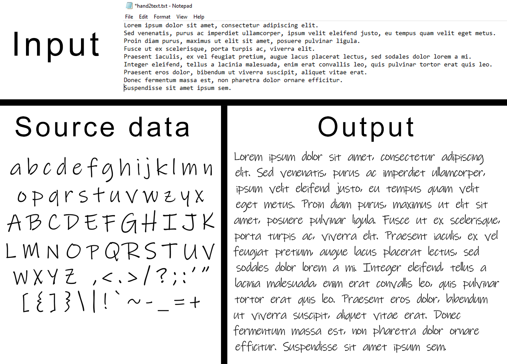

<div align="center">

# Convert a digital text file to your handwriting

<a href='https://www.linkedin.com/in/erik-z%C3%A1vodsk%C3%BD-126a82144/'></a>


Libraries used


</div>

## Sample #1 &ndash; my own handwriting

### Input (showing a cropped part of both the source data and output)


## Sample output #2 &ndash; Ink Free font

The image below is a recreation of the Ink Free font using this repo's code. The source data used was just a single screenshot of all letters in the alphabet written with this font in Photoshop (source data in the image below).



## Uploading your handwriting

Take a blank A4 paper and separately write down each letter. Make sure to include all lowercase and uppercase letters, as well as punctuation characters you'd like to use (such as a dot, comma, or quotation marks). For reference, check out `base/inkfree.png`.

Additionally, you can decide to write each character multiple times to add some variation to the final result. If you do so, make sure the number of variations per each character is equal.

Download the free _Tiny Scanner_ application to your phone (I'm not affiliated with the product). The app's full name on appstore is _Scanner App: Scan PDF Document_

Open the app and take a picture of your handwriting. Continue with default options (saving in grayscale mode) and then upload the picture as a .png or .jpg file somewhere you can access it from your computer (I send it to myself via e-mail).

Download and place the image in the `base` folder.

## Crop the characters

### 1.0 Preprocessing

```
> python crop.py transform-image
```

Run the above, then enter the path for the image of your handwriting. You'll be prompted to rescale the image to some percentage of its original size (default is 50%). The goal is to rescale the image such that it fits the entire screen, making it possible to then crop out each character from it.

Once you close the image window, you'll be prompted to either continue and or rescale the image again. Iterate over this a few times until the aforementioned goal is accomplished, then save the image.

By default, the image resolution that fill the screen's height is simply the height of your screen resolution minus ~100 (pixels) to account for the top image window bar.

Note: I'm aware this may not be the most elegant solution, but given that everyone's screen resolution along with the resolution of their handwriting image may be different, this was the best I could think of.

### 1.1 Manual cropping

Create a folder in the root directory where the cropped character images will go. The default path to this file is `manual_crop`, so I suggest naming it that for convenience.

```
> python crop.py crop-manual
```

> Example input

_Path to destination folder:_ `manual_crop`

_Path to image to crop the characters from:_ `base/myhandwriting.jpg`

_Number of variations for each of your characters:_ `4`

_Define the punctuation characters you'll be using:_ `,./;':"`

- Once the image window opens, the command line will tell you which character to crop (if you have more than 1 variation per character, the order in which you crop them doesn't matter)
- Make a selection around the character by holding _left-click_ and dragging, which will draw a green square. Don't worry about making imperfect selections and leaving some space around the letter &ndash; as long as the selection fully encapsulates the letter and nothing else, it's fine
- If you're unhappy with the selection, press `r` to erase it and start over
- If you're happy with the selection, press `c` to crop the image and see a preview of the cropped image. Press `s` to save
- Iterate over this process until all the characters have been cropped and the scrip automatically terminates
- If you wish to terminate the process at any point, press `q`.

### 1.2 Autocropping

Create a folder in the root directory where the autocropped character images will go. The default path to this file is `autocropped`, so I suggest naming it that for convenience.

```
> python crop.py crop-auto
```

This takes the character images you manually cropped and performs automatic cropping such that it leaves no padding around the image.

## Classify your handwriting based on character height

Head over to the `txtsplit` folder. In this step, you'll need to define which letters in your handwriting belong to which "class". See the image as well as examples for my own handwriting below to understand what is meant by this.

### Letters


**`lowercase_mid`** &ndash; characters that fit within one line

- Example: _qwertuioasjxcvnm_

**`lowercase_high`** &ndash; characters that exceed the standard height (line) of "mid" characters in the upwards direction

- Example: _dhklf_

**`lowercase_low`** &ndash; characters that exceed the standard height (line) of "mid" characters in the downwards direction

- Example: _pqgy_

I set some default characters in each file based on how we typically write lowercase characters. Everyone's handwriting is different though, so modify this to your specific use case.

### Punctuation

I don't recommend editing the files for punctuation characters because these almost always have the same vertical position on a line, regardless of a person's handwriting. If you decide to modify these anyway, here's a quick guide:

- **Punctuation low**: characters placed at the bottom of a line (dots, commas, or underscores)
- **Punctuation mid**: characters whose height is approximately equal to _lowercase_high_ or one line (question marks or various types of brackets)
- **Punctuation high**: characters placed at the top of a line (apostrophe, quotation marks)
- **Punctuation small**: characters placed in the middle of the line whose height is "small" (mathematical operators, hyphens, en-dashes, semi-colons)

**Note #1** &ndash; do not rename the image files in either `manual_crop` or `autocropped`

**Note #2** &ndash; do not modifty the `alllowercase.txt` and `uppercase.txt` files (unless you won't be using all letters in the alphabet)

## Convert text to handwriting

Write the text you wish to convert into handwriting in the _hand2text.txt_ file. If the text is all in one line, that's fine.

```
> python handwriting.py handwriting
```

The defaults for available parameters are what worked well for me, but feel free to play around with it to customize your output.

## QnA & Issues

### Handwriting in the output image is too small

TL;DR

If the handwriting in your output appears too small without needing to zoom in, try running `python crop.py transform-image` and downscale the background image.

**Explanation**

By default, the background image that the character images will be pasted on is _background.png_, which is a standard A4 canvas downsclaed to 50% of its original size. This is because most people will likely need to downscale the image of their handwriting in the preprocessing phase. This effectively makes the characters smaller, and thus the background image needs to be downscaled too in order to prevent the "handwriting" from looking too small on the canvas.

### Individual words in the output are too far apart from one another

The image used for the space character is `base/32.png`. If the above issue is true for you, resize this image in width (Microsoft's native _Photos_ can do this easily).

## Acknowledgements

- Adrian Rosebrock for [this](https://www.pyimagesearch.com/2015/03/09/capturing-mouse-click-events-with-python-and-opencv/) article that lay the foundation for a key functionality in this repo
- @Pranav082001 for the initial idea and much of logic behind `handwriting.py`
